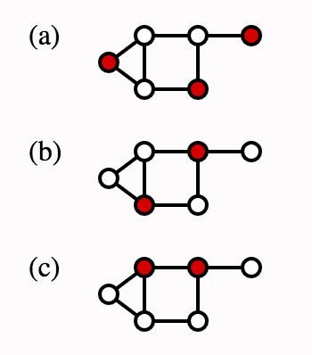
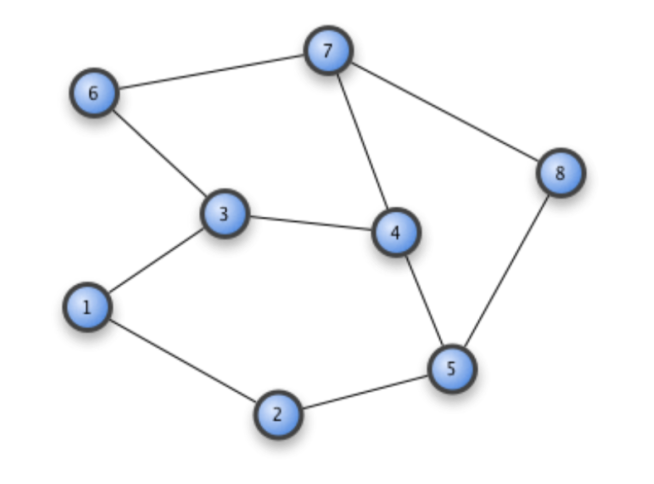
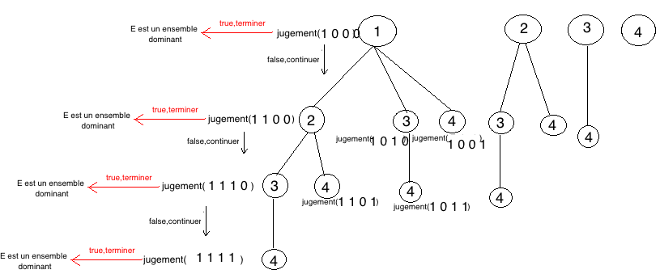

# Algorithme for SDSP(Smallest Dominating Set Problem) and its realisation by Java
In graph theory, a `dominating set` for a graph G = (V, E) is a subset D of V such that every vertex not in D is adjacent to at least one member of D. The domination number γ(G) is the number of vertices in a smallest dominating set for G.

For exemple, in the picture above, the set of red point is a dominating set. 

In a same graphe, there are probably several dominating sets, and which contains different numbers of elements. The objectif of this algorithme is to find out `all of the dominating set` with minimal numbers of element.

The dominating set problem concerns testing whether γ(G) ≤ K for a given graph G and input K; it is a classical `NP-complete` decision problem in computational complexity theory (Garey & Johnson 1979). Therefore it is believed that there is no efficient algorithm that finds a smallest dominating set for a given graph.

For this reason, the algorithm that I proposed for SDSP is only infinitely close to the real situation, and can not completely solve this problem.

Then this algorithm will be based on the above figure, of course, we can choose no matter what kind of graphe here, this algorithm is always applicable.

###Example for graphe of 4 elements

